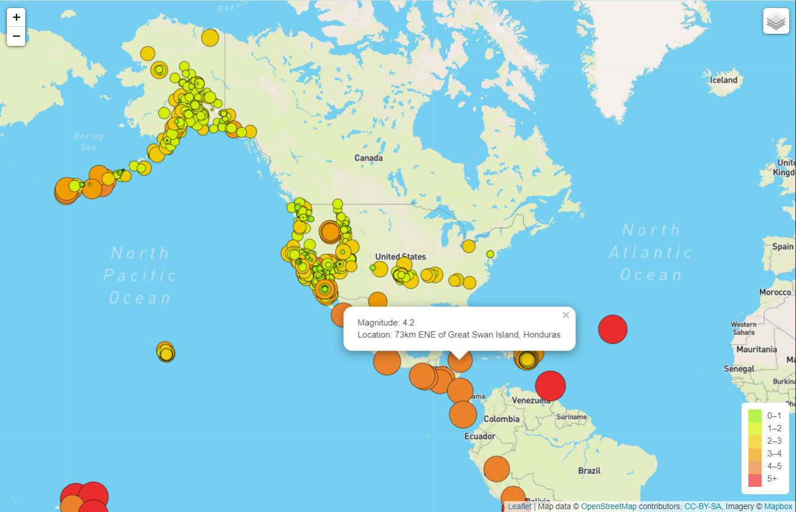
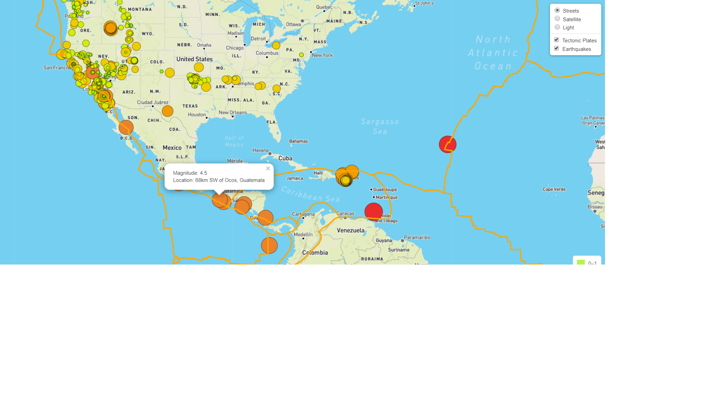
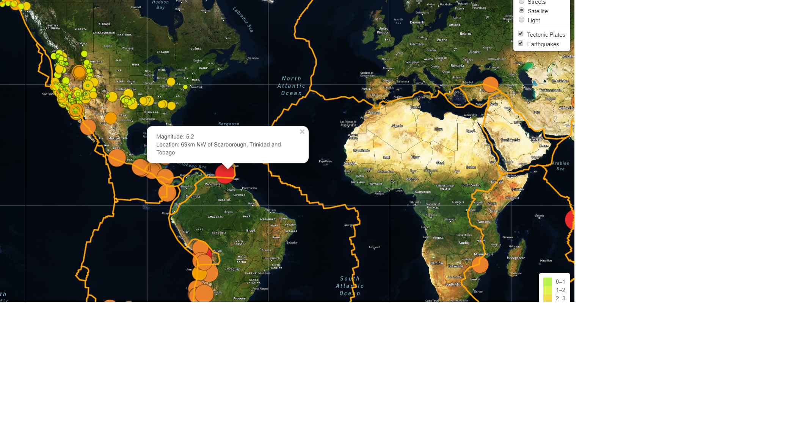
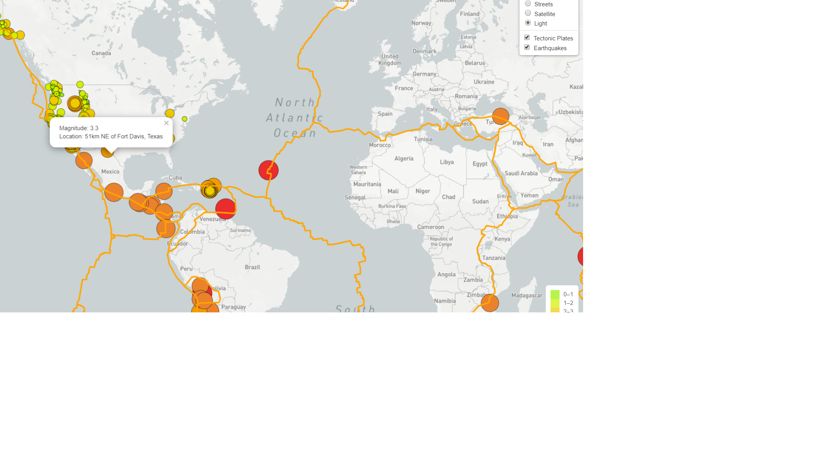

# Mapping_Earthquakes
GeoJSON , Leafletjs, Javascript
## Project Overview
The project requires us to build the Leaflet.js map to show the earthquake details and with the useful popup. The map show the earthquake details in street and satelite view with the legend. The legend shows the magnitude of the earthquake . 
## Resources
- Data Source: USGS URL for earthquake data
- Software: Leaflet.js,Bootstrap,D3.js,Javascript and Html.
 ## Mapping the EarthQuake details  :
The map below shows the earthquake details with the legend in the streetview.

## Challenge Overview
The challenge's objective was to add the **tectonic plates** details in the earthquake map and also add the extra **light layer** in the map along with street and satelite view.
## Challenge Result.
The map below shows the earthquake details with the legend in the **streetview.**

The map below shows the earthquake details with the legend in the **sateliteview.**

The map below shows the earthquake details with the legend in the **lightview.**

